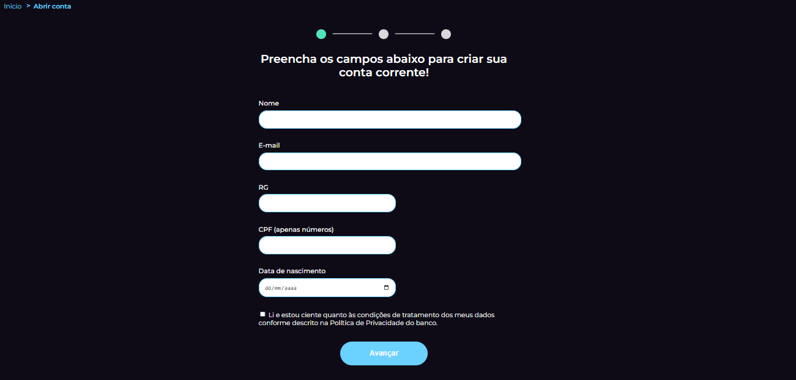
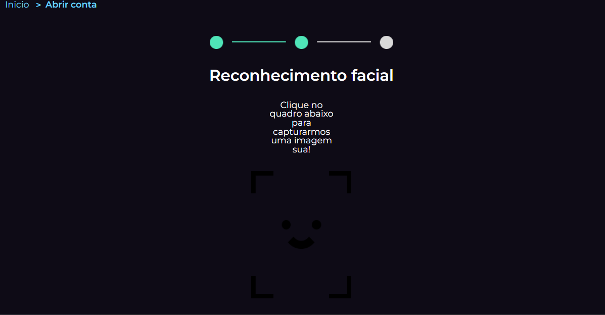
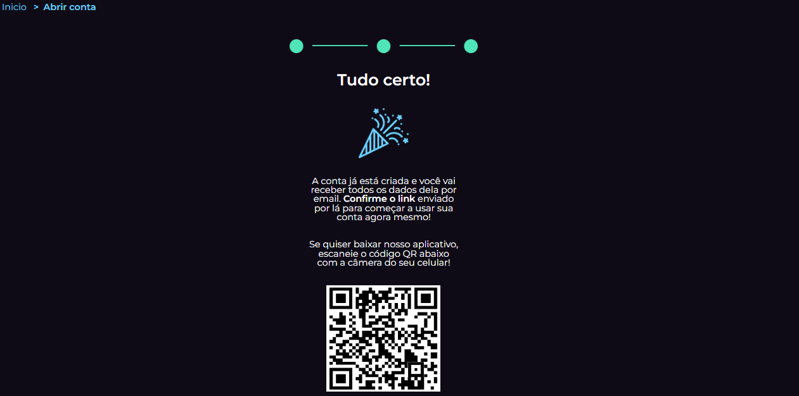

<h1>AquiBank</h1>

<h2>🔖 Sobre</h2>

Projeto criado para o desenvolvimento de meus conhecimentos em JavaScript.

## 🚀 Tecnologias

  
  
  

 Trata-se de uma página web de um banco digiral. O foco é trazer a experiência de uma criação de conta em um banco, passando por 2 etapas, cadastro de formulário e depois um cadastro fácial. Ambos os tipos de dados são alocados em um banco de dados local no navegador do usuário (localStorage). 
## Screenshots

